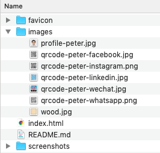
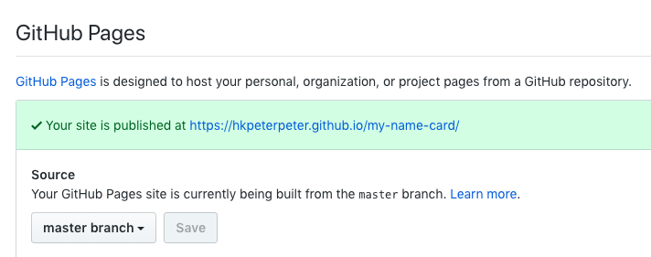
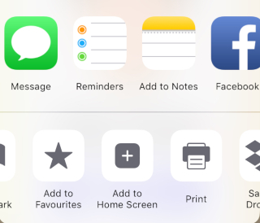
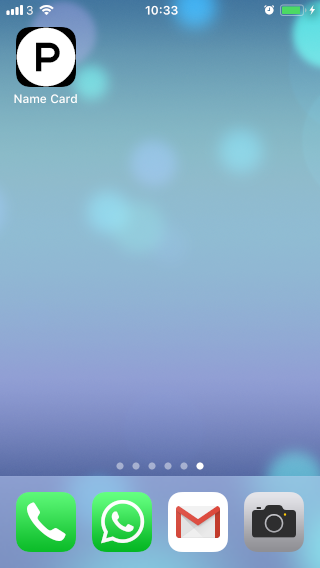

# My name card 

My digital name card: [https://hkpeterpeter.github.io/my-name-card/](https://hkpeterpeter.github.io/my-name-card/)

## Codepen demo

CodePen: [https://codepen.io/hkpeterpeter/pen/zYoxrPo](https://codepen.io/hkpeterpeter/pen/zYoxrPo)

## Demo on a mobile phone

## Steps to build your own name card

1. **Fork** and **Clone** this project
2. [Modify these 2 lines](https://github.com/hkpeterpeter/my-name-card/blob/dc4188506366f624a1803339f54ffa7f0f709ede/index.html#L133-L134) in index.html
3. Replace the following images: 

4. Push your changes back to your cloned GitHub repository
5. In **Settings**, publish the website as a GitHub page. For example:

6. In **iOS**, open the website in **Safari**, choose **Add to Home Screen**:

7. Now, you have your own name card webapp

## References

- [3D transformation explanation in CSS](https://3dtransforms.desandro.com/)
- [CoolPen demo by the author](https://codepen.io/desandro/pen/KRWjzm)

